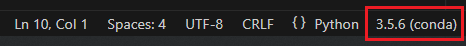

# comp4900RL
Repo for the development work on the Comp 4900 C group project

 CREDIT: Much of this state and environment code comes from Andrew Ho https://github.com/andrewkho/wordle-solver
 
 CREDIT: The render function was adapted from Zach's implementation of it https://github.com/zach-lawless/gym-wordle

# Installation and Setup

1. Clone the repo
    ``` Powershell
        cd <WorkingDirToCloneTo>
        git clone https://github.com/malbe074/comp4900RL.git
    ```
<br>


2. Install Miniconda (https://docs.conda.io/projects/miniconda/en/latest/)
    ``` Powershell
    curl https://repo.anaconda.com/miniconda/Miniconda3-latest-Windows-x86_64.exe -o miniconda.exe
    start /wait "" miniconda.exe /S
    del miniconda.exe
    ```
<br>

3. Install Mamba (https://anaconda.org/conda-forge/mamba)
    - Open "Anaconda Powershell Prompt (R-MINI~1)" and run
        ``` Powershell
        conda install -c conda-forge mamba
        ```
<br>

4. Create and activate the environment
    ``` Powershell
    cd <directory with 4900RL_env.yml >
    mamba env create -f 4900RL_env.yml
    conda activate 4900RL
    ```
<br>

5. Install and configure Visual Studio Code (https://code.visualstudio.com/)
    - Install the environment manager extension to enable VScode to execute code from the Anaconda environment.
    - This comes as part of a nice package
        - https://marketplace.visualstudio.com/items?itemName=donjayamanne.python-extension-pack
    - Or can be installed separately, and use whatever other python extensions you prefer
        - https://marketplace.visualstudio.com/items?itemName=donjayamanne.python-environment-manager
<br><br>

6. Before running your python file set your execution environment in the bottom toolbar
    
   
7. Shaun says hi
